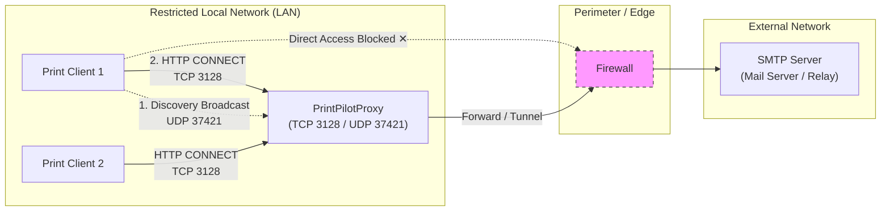

# PrintPilotProxy

PrintPilotProxy is a forward HTTP/HTTPS proxy designed to enable PrintPilot clients to communicate over restricted networks. It safely tunnels traffic through firewalls while providing granular access control, security auditing, and monitoring.

## Why PrintPilotProxy?

In highly secured environments (like hospitals or financial institutions), print clients often cannot connect directly to external mail/SMTP servers due to firewall restrictions. PrintPilotProxy solves this by acting as a secure intermediary.

## Features

- **Forward HTTP/HTTPS Proxy**: Tunnels traffic securely using CONNECT.
- **Client Access Control (ACL)**: Restrict access by IP or CIDR ranges.
- **Destination Port Restrictions**: Only allow connections to required ports (e.g., 80, 443).
- **Windows Service**: Runs seamlessly in the background on Windows.
- **WPF Management Interface**: Graphical interface for configuration and monitoring.
- **Security Audits**: Automated checks to ensure your configuration is secure.

## Supported Platforms

- **Windows**: Fully supported (Windows Service, WPF UI).
- **Linux**: Planned for future releases (systemd, headless operation).

## Quick Start

Take your system from nothing installed to PrintPilot using the proxy with these simple steps:

1. **Install**: Download and install PrintPilotProxy on your intended proxy server.
2. **Open App**: Launch the PrintPilotProxy Management application.
3. **Select Interface**: Choose the network interface to bind the proxy to.
4. **Config Port**: Ensure the port is set (default 3128).
5. **Add Client IP**: Add the IP address of your PrintPilot PC to the Allowed Clients list.
6. **Apply**: Save the configuration changes.
7. **Start**: Start the proxy service.
8. **Configure Client**: Configure your PrintPilot client to use the proxy server's IP and port.

## Configuration Overview

Configuration is stored in `C:\ProgramData\PrintPilotProxy\config.json`. You can manage it via the WPF UI or edit it directly.

## Proxy Engine

PrintPilotProxy uses the **Unobtanium Web Proxy** engine. After evaluating alternatives like Titanium, YARP, and FiddlerCore, Unobtanium was selected for its robust MITM capabilities and straightforward configuration, though we disable interception for PrintPilotProxy.

## Integration

Configure your PrintPilot clients to use the proxy server's IP and port (default 3128) or use LAN Auto-Discovery (UDP 37421).

## Building from Source

1. Clone the repository.
2. Run `dotnet build`.
3. Run tests with `dotnet test`.

## Contributing

Please see [CONTRIBUTING.md](CONTRIBUTING.md) for details on how to contribute.

## License

This project is licensed under the MIT License. See [THIRD-PARTY-NOTICES.md](THIRD-PARTY-NOTICES.md) for details on third-party dependencies.
