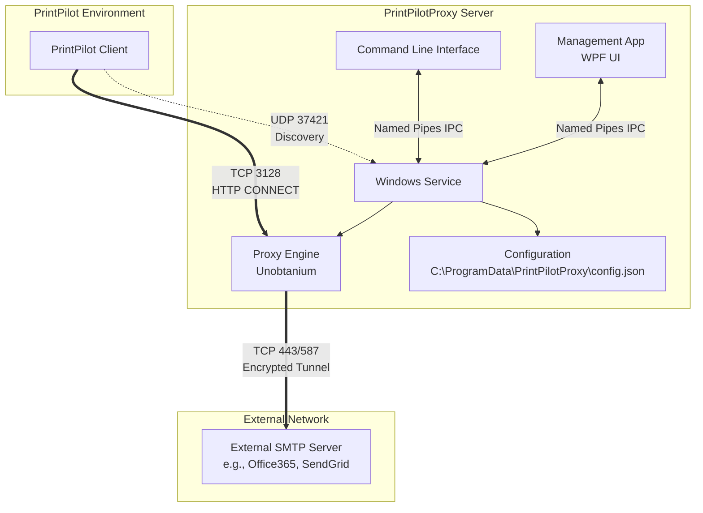

# Architecture

PrintPilotProxy is designed with a clean architecture and separation of concerns, heavily utilizing .NET 8 standard libraries.

## System Overview

## Component Breakdown

1. **`PrintPilotProxy.Core`**
   - **Responsibility**: Contains platform-independent domain models (`ProxyConfiguration`), validation logic, interfaces, and security logic.
   - **Key Fact**: Has no dependencies on the proxy engine or UI frameworks.

2. **`PrintPilotProxy.Proxy`**
   - **Responsibility**: Implements the `IProxyEngine` abstraction.
   - **Details**: Wraps the **Unobtanium Web Proxy** library (version 0.1.5, MIT License). Handles incoming HTTP CONNECT requests, enforces the Access Control List (ACL), validates HMAC authentication, and establishes the tunnel. Interception/decryption is explicitly disabled.
   - **Why Unobtanium?**: After evaluating alternatives like Titanium, YARP, Caddy, Squid, FiddlerCore, and PassThroughProxy, Unobtanium provided the right balance of a native .NET API, robust connection handling, and a lightweight footprint.

3. **`PrintPilotProxy.Service`**
   - **Responsibility**: The long-running Windows Service host (`IHostedService`).
   - **Details**: Hosts the proxy engine, manages Windows Firewall rules for the product, handles UDP auto-discovery, and exposes a Named Pipe IPC server for management.

4. **`PrintPilotProxy.App`**
   - **Responsibility**: The graphical management application (WPF).
   - **Details**: Uses `CommunityToolkit.Mvvm`. It does not manage the proxy directly; instead, it acts as a client that sends configuration updates and status requests to the Windows Service via IPC.

5. **`PrintPilotProxy.Cli`**
   - **Responsibility**: Command-line management interface.
   - **Details**: Uses the same IPC mechanisms as the App to control the background service.

6. **`PrintPilotProxy.Infrastructure`**
   - **Responsibility**: Platform-specific implementations.
   - **Details**: Manages file paths (e.g., `C:\ProgramData\PrintPilotProxy`), reads/writes JSON configuration, and provides the HMAC authenticator logic.

## Cross-Platform Considerations
While the solution currently focuses on Windows environments (utilizing Windows Services and WPF), the `Core`, `Proxy`, and `Infrastructure` layers are built on .NET 8. 
**Planned Linux Support**: Future support for Linux will focus on headless operation running as a `systemd` service for background execution, leveraging the CLI for management. A graphical UI for Linux is not planned.
